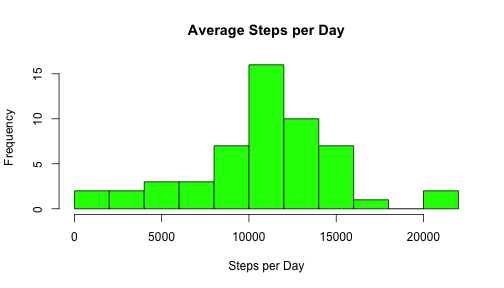
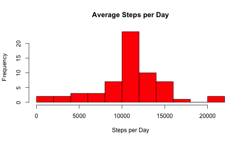
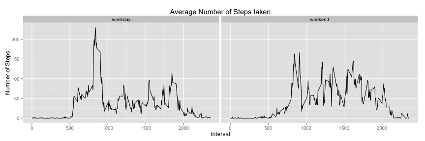

# Reproducible Research: Peer Assessment 1
========================================================

## (1) Loading and preprocessing the data
========================================================

```r
if (!file.exists("data")) {
  dir.create("data")
} 
fileURL <- "https://d396qusza40orc.cloudfront.net/repdata%2Fdata%2Factivity.zip"
download.file(fileURL,destfile="~/data/activity_monitoring.csv",method="curl")
dateDownloaded <-date()

df <- read.table("~/Data/activity.csv", sep=",", header=TRUE)
summary(df)
```

```
##      steps               date          interval   
##  Min.   :  0.0   2012-10-01:  288   Min.   :   0  
##  1st Qu.:  0.0   2012-10-02:  288   1st Qu.: 589  
##  Median :  0.0   2012-10-03:  288   Median :1178  
##  Mean   : 37.4   2012-10-04:  288   Mean   :1178  
##  3rd Qu.: 12.0   2012-10-05:  288   3rd Qu.:1766  
##  Max.   :806.0   2012-10-06:  288   Max.   :2355  
##  NA's   :2304    (Other)   :15840
```
**Note about the data:** *The dataset shows the steps for every 5-minute time interval (288 per day) in October and November 2012 (61 days). N=17568 with 2304 Missing Values, e.g.: about every 8th overservation is missing.*

## (2) What is mean total number of steps taken per day?
========================================================

```r
d<-aggregate(cbind(steps) ~ date, data=df, FUN=sum)
hist(d$steps,breaks=10,col="green",main="Average Steps per Day",xlab="Steps per Day")
```

 

```r
mean(d$steps)
```

```
## [1] 10766
```

```r
median(d$steps)
```

```
## [1] 10765
```

```r
summary(d)
```

```
##          date        steps      
##  2012-10-02: 1   Min.   :   41  
##  2012-10-03: 1   1st Qu.: 8841  
##  2012-10-04: 1   Median :10765  
##  2012-10-05: 1   Mean   :10766  
##  2012-10-06: 1   3rd Qu.:13294  
##  2012-10-07: 1   Max.   :21194  
##  (Other)   :47
```
**Note:** *The dataset now consists of 53 days (8 days are missing).*

## (3) What is the average daily activity pattern?
========================================================
**Note:** *I understand this in that way, that the plot should show the invervalls for an average day, i.e.: the time series consists of the first interval (=0), the second interval (=5), ... where each interval is the mean of all days for this particular interval.*

```r
e<-aggregate(steps ~ interval, data=df, FUN=mean)
plot(e$interval, e$steps, type="l", main="Activity Pattern on an Average Day", xlab="Invervalls (min)", ylab="Steps")
```

 

```r
maxStepsInterval<-e$interval[which.max(e$steps)]
maxStepsInterval
```

```
## [1] 835
```
The interval with the maximum average steps is **835**!

## (4) Imputing missing values
========================================================
### (4.1) Calculate and report the number of missing values

```r
colSums(is.na(df))
```

```
##    steps     date interval 
##     2304        0        0
```
There are **2304** Missing Values in the colomn *Steps*, **0** in the colomn *Date* and **0** in the colomn *Interval*. A deeper look at the distribution of NAs shows that from the 61 days 8 days are missing (1st, 8th October and 1st, 4th, 9th, 10th, 14th and 30th November. These are
- 2 Mondays,
- 1 Tuesday,
- 1 Wednesday,
- 0 Thursday,
- 2 Fridays, and
- 1 Saturday):

```r
df_NA <- df[!complete.cases(df),] #NA-subset of df
summary(df_NA$date) #shows number of NAs per day
```

```
## 2012-10-01 2012-10-02 2012-10-03 2012-10-04 2012-10-05 2012-10-06 
##        288          0          0          0          0          0 
## 2012-10-07 2012-10-08 2012-10-09 2012-10-10 2012-10-11 2012-10-12 
##          0        288          0          0          0          0 
## 2012-10-13 2012-10-14 2012-10-15 2012-10-16 2012-10-17 2012-10-18 
##          0          0          0          0          0          0 
## 2012-10-19 2012-10-20 2012-10-21 2012-10-22 2012-10-23 2012-10-24 
##          0          0          0          0          0          0 
## 2012-10-25 2012-10-26 2012-10-27 2012-10-28 2012-10-29 2012-10-30 
##          0          0          0          0          0          0 
## 2012-10-31 2012-11-01 2012-11-02 2012-11-03 2012-11-04 2012-11-05 
##          0        288          0          0        288          0 
## 2012-11-06 2012-11-07 2012-11-08 2012-11-09 2012-11-10 2012-11-11 
##          0          0          0        288        288          0 
## 2012-11-12 2012-11-13 2012-11-14 2012-11-15 2012-11-16 2012-11-17 
##          0          0        288          0          0          0 
## 2012-11-18 2012-11-19 2012-11-20 2012-11-21 2012-11-22 2012-11-23 
##          0          0          0          0          0          0 
## 2012-11-24 2012-11-25 2012-11-26 2012-11-27 2012-11-28 2012-11-29 
##          0          0          0          0          0          0 
## 2012-11-30 
##        288
```
### 4.2 Devise a strategy for filling in all of the missing values in the datase
I decided to replace the missing values by the mean of the 5-minute interval (as suggested in the assignment). The next subsection shows the code ..
### 4.2 Create a new dataset that is equal to the original dataset but with the missing data filled in
The following code replaces the NAs by the mean of the 5-minute interval:

```r
df2 <- df
for (i in 1 : length(df2$steps)) { #A
  if (is.na(df2[i,1])) { #B
    temp <- e[ which(e$interval == df2[i,3]),] #C
    df2[i,1] <- temp$steps  #D
  }
}
summary(df2)
```

```
##      steps               date          interval   
##  Min.   :  0.0   2012-10-01:  288   Min.   :   0  
##  1st Qu.:  0.0   2012-10-02:  288   1st Qu.: 589  
##  Median :  0.0   2012-10-03:  288   Median :1178  
##  Mean   : 37.4   2012-10-04:  288   Mean   :1178  
##  3rd Qu.: 27.0   2012-10-05:  288   3rd Qu.:1766  
##  Max.   :806.0   2012-10-06:  288   Max.   :2355  
##                  (Other)   :15840
```
**Note:** *The Loop goes through every observation (A), checks if the 1st colomn (=date) has NA (B), if so it looks for the corresponding steps-per-interval value [C] and replaces the NA with this particular value (D)*

### 4.4 Make a histogram of the total number of steps taken each day and Calculate ...
The mean and median after replacing NA's by the mean of the 5-minute interval **is exactly the same**:

```r
d2<-aggregate(cbind(steps) ~ date, data=df2, FUN=sum)
hist(d2$steps,breaks=10,col="red",main="Average Steps per Day",xlab="Steps per Day")
```

 

```r
mean(d2$steps)
```

```
## [1] 10766
```

```r
median(d2$steps)
```

```
## [1] 10766
```

```r
summary(d2)
```

```
##          date        steps      
##  2012-10-01: 1   Min.   :   41  
##  2012-10-02: 1   1st Qu.: 9819  
##  2012-10-03: 1   Median :10766  
##  2012-10-04: 1   Mean   :10766  
##  2012-10-05: 1   3rd Qu.:12811  
##  2012-10-06: 1   Max.   :21194  
##  (Other)   :55
```
**The reason for that is:** I replaced the missing values (e.g. the 8 missing dates) with the interval's average of the remaining 53 days. These were summed up and as a result the average steps on these days (1st, 8th October, etc.) is 10766 which is of course exactly the average of all days. 
*Or in other words: Adding the average of a variable to this variable and building the mean results in the same value.*

**Note:** *So for this analysis the strategy for replacing the missing values didn't make sense. Anyway, I stuck with this strategy as this strategy was explicitely suggested in the assignment.*

## (5) Are there differences in activity patterns between weekdays and weekends?
========================================================
### (5.1) Create a new factor variable in the dataset with two levels ...

```r
t<-df2
for (i in 1:length(t$date)){ 
  t[i,4] = weekdays(as.Date(t[i,2])) #insert weekday
  if (t[i,4] == "Saturday" | t[i,4] == "Sunday") {t[i,5] = "weekend"}
  else {t[i,5] = "weekday"}
  
}
colnames(t)[4:5] <- c("day","weekday")
t$weekday<-as.factor(t$weekday)
summary(t)
```

```
##      steps               date          interval        day           
##  Min.   :  0.0   2012-10-01:  288   Min.   :   0   Length:17568      
##  1st Qu.:  0.0   2012-10-02:  288   1st Qu.: 589   Class :character  
##  Median :  0.0   2012-10-03:  288   Median :1178   Mode  :character  
##  Mean   : 37.4   2012-10-04:  288   Mean   :1178                     
##  3rd Qu.: 27.0   2012-10-05:  288   3rd Qu.:1766                     
##  Max.   :806.0   2012-10-06:  288   Max.   :2355                     
##                  (Other)   :15840                                    
##     weekday     
##  weekday:12960  
##  weekend: 4608  
##                 
##                 
##                 
##                 
## 
```
### (5.2) Make a panel plot containing a time series ...
I understand this assignment, that the graphs should show the average daily activity pattern. One graph for weekdays, one for weekends.

```r
z<-t
z<-aggregate(steps ~ interval+weekday, data=t, FUN=mean)

library(ggplot2)
g <- ggplot(z, aes(x = z$interval, y = z$steps),facets = weekday~.)
g + geom_line() + facet_grid(.~weekday) + labs(title="Average Number of Steps taken", x="Interval", y="Number of Steps")
```

 
